class: center middle bg-navy white

```{r setup, include=FALSE}
options(htmltools.dir.version = FALSE)
knitr::opts_chunk$set(
  fig.width=9, fig.height=3.5, fig.retina=3,
  out.width = "100%",
  cache = FALSE,
  echo = TRUE,
  message = FALSE, 
  warning = FALSE,
  fig.show = TRUE,
  hiline = TRUE
)
```

```{r xaringan-themer, include=FALSE, warning=FALSE}
library(xaringanthemer)
blue <- "#33B1FF"
navy <- "#302E44"
grey <- "#DFDFDF"
pink <- "#F44B70"
white <- "#ffffff"
light <- "#E6F6FF"
style_duo_accent(
  base_font_size = "24px",
  primary_color = navy,
  secondary_color = blue,
  black_color = navy,
  header_color = blue,
  link_color = pink,
  code_inline_color = pink,
  inverse_header_color = white,
  header_h2_font_size = "2.0rem",
  header_font_google = google_font("Kiwi Maru", "400"),
  extra_css = list(
    ".inverse code" = list("color" = white),
    ".title h1"  = list("color" = white),
    ".title a"  = list("color" = white)
  ),
  colors = list(
    blue = blue,
    navy = navy,
    grey = grey,
    pink = pink,
    white = white
  )
)
```

```{r metathis, echo=FALSE}
# Based on https://www.garrickadenbuie.com/blog/sharing-xaringan-slides/
library(metathis)
meta() %>%
  meta_name("github-repo" = "cwickham/this-month-i-learned") %>% 
  meta_social(
    title = "This Month I Learned...",
    description = paste(
      "Presented at Rladies DC April 2021."
    ),
    url = "https://cwickham.github.io/this-month-I-learned",
    image = "https://raw.githubusercontent.com/cwickham/this-month-I-learned/main/social-card.png",
    image_alt = paste(
      "Title slide of 'This Month I Learned...'", 
      "Presented at Rladies DC, April 2021, by Charlotte Wickham."
    ),
    og_type = "website",
    og_author = "Charlotte Wickham",
    twitter_card_type = "summary_large_image",
    twitter_creator = "@cvwickham"
  )
```

.pull-left[

]

.pull-right[

.title[
# This Month I Learned...
<https://cwickham.github.io/this-month-I-learned/>
] 
Charlotte Wickham  
@ Rladies DC, April 2021  
]


---

class: middle

.left-column[


[`r icons::icon_style(icons::fontawesome("github"), fill = pink)` @cwickham](https://github.com/cwickham)  
[`r icons::icon_style(icons::fontawesome("twitter"), fill = pink)` @cvwickham](https://twitter.com/cvwickham)
[cwick.co.nz](https://cwick.co.nz)
]

.right-column[

## Hello, my name is 

## .navy[Charlotte Wickham]

* Part-time @ Oregon State University, Statistics Department

* Independent R Trainer and Consultant

]

---

class: middle center

.pull-left[
# Everyone is Still Learning
]

.pull-right[

]


---

#### The way I learn

--

## 1. Do an example with guidance

--

## 2. Apply it to something I care about

--

## 3. Teach it to someone else

--

---

class: middle

.pull-left[
### But this all requires

## 0\. I Know it Exists
]

.pull-right[
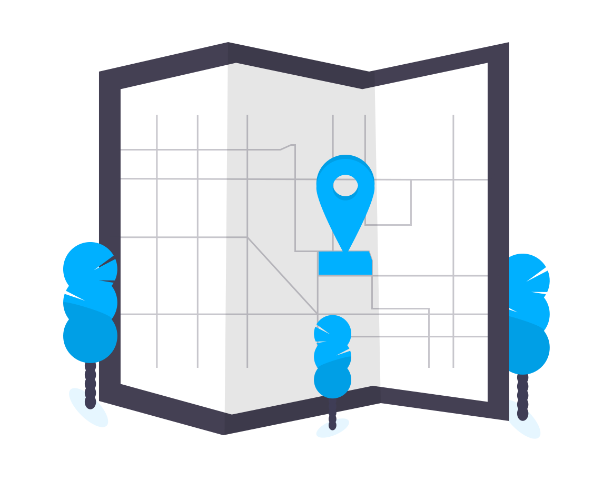
]


---

## Things I Learned ~~This Month~~ in January
 
--

* Using Visual Editor Mode in RStudio

--

* Add a Snippet to RStudio

--

* Raw Character Strings

--

* Storing GitHub Credentials (better)

--

* `dplyr::rowwise`

--

#### You get: exposure, and ideas for exposure

#### I get: to teach

---

layout: false
class: inverse center middle

# Visual Editor Mode in RStudio

---

.pull-left[

## Visual Editor Mode

#### Activate in any RMarkdown file
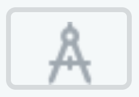
]

.pull-right[
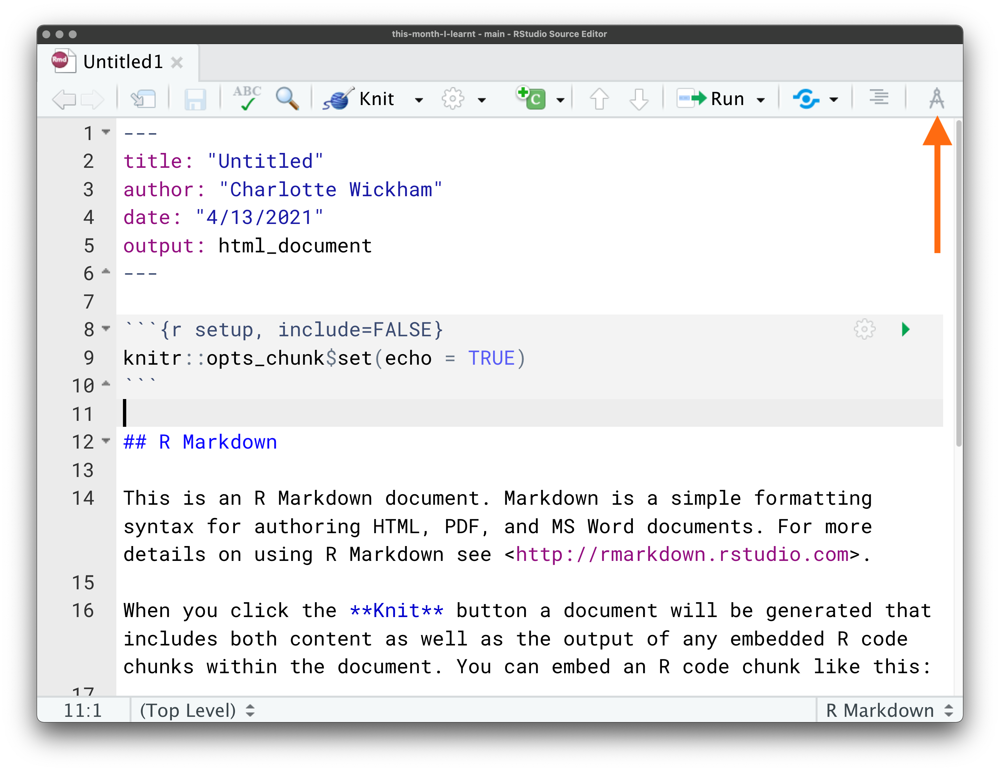
]

---


.pull-left[

## Visual Editor Mode

#### What You See is What You Get

]

.pull-right[
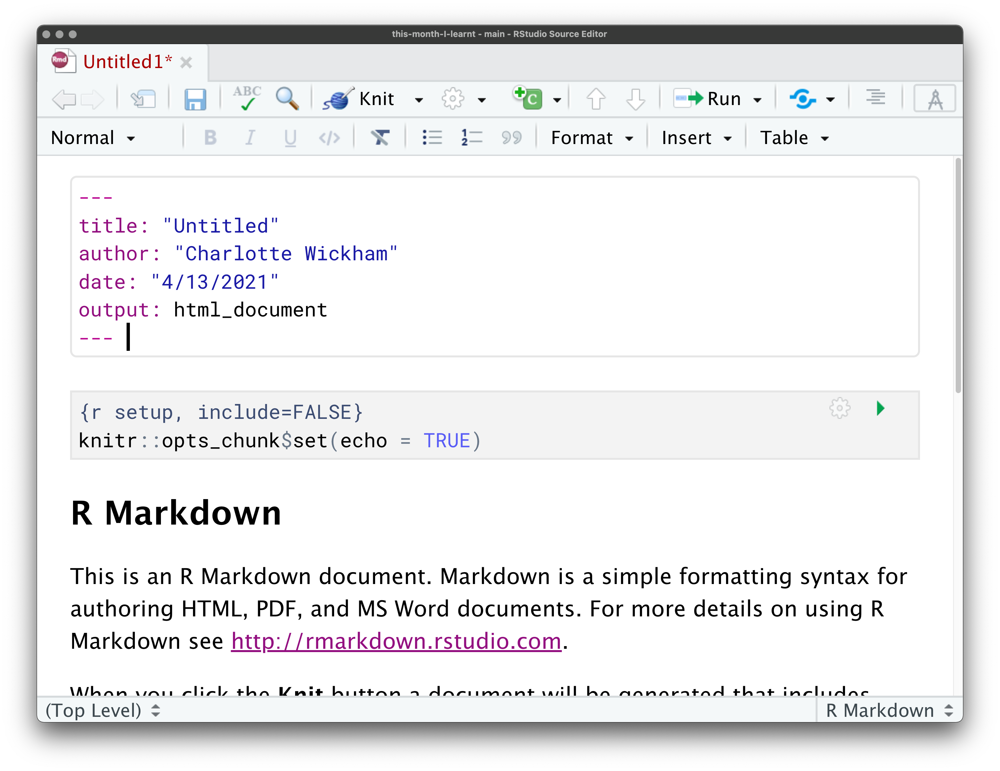
]

---

class: middle

.pull-left[
## One Reason To Try It: Tables! 
]

.pull-right[
<video width="400" height="400" controls>
    <source src="assets/visual-editor-tables.mp4" type="video/mp4"> </video>
]

---


## Learning Journey

.pull-left[
I saw a tweet during `rstudio::global(2021)`.

I had no idea what they were talking about. New in RStudio 1.4.

More at: https://rstudio.github.io/visual-markdown-editing
]

.pull-right[
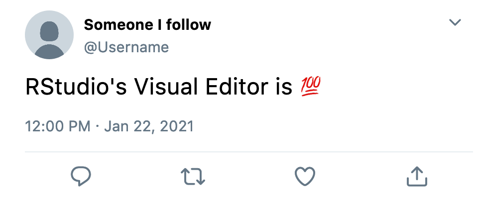
]

---
class: inverse center middle

# Add a Snippet to RStudio

---

## Snippets Add Chunks of Code

.pull-left[

#### Insert a Snippet

1. Type a keyword

2. Hit Shift + Tab

3. Hit Tab to cycle through placeholders

#### Example: `shinyapp`   

]

.pull-right[

<video width="400" height="400" controls><source src="assets/snippet-shinyapp.mp4" type="video/mp4"></video>
    
]


---

## Snippets Add Chunks of Code

.pull-left[

#### Insert a Snippet

1. Type a keyword

2. Hit Shift + Tab

3. Hit Tab to cycle through placeholders
    
#### Example: `fun`    
]

.pull-right[
<video width="400" height="400" controls>
    <source src="assets/snippet-fun.mp4" type="video/mp4"> </video>

]

---

.pull-left[
## Add Your Own Snippet

#### Tools -> Global Options

]

.pull-right[
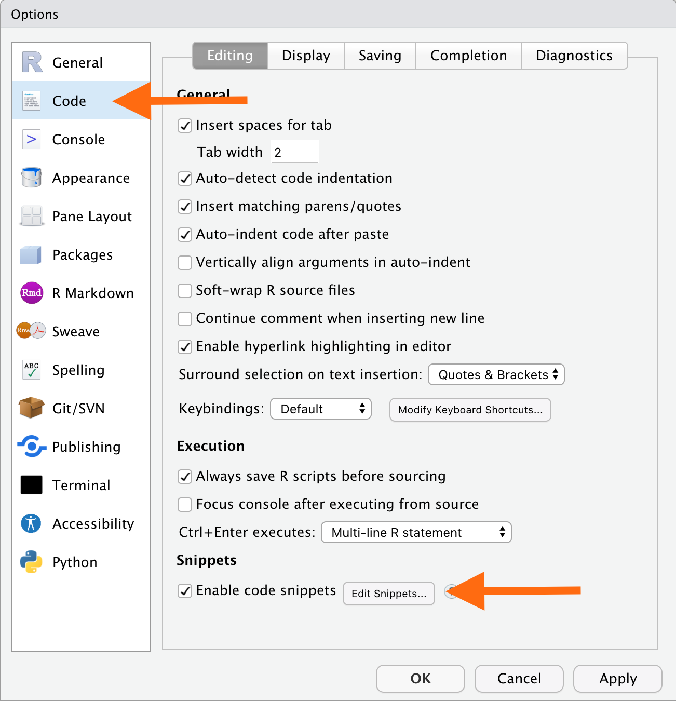
]

---

.pull-left[

## Add Your Own Snippet

#### Edit Snippets


    snippet tidy
  	  `​``{r setup, message = FALSE}
  	  library(tidyverse)
  	  ``​`
  	
]

.pull-right[
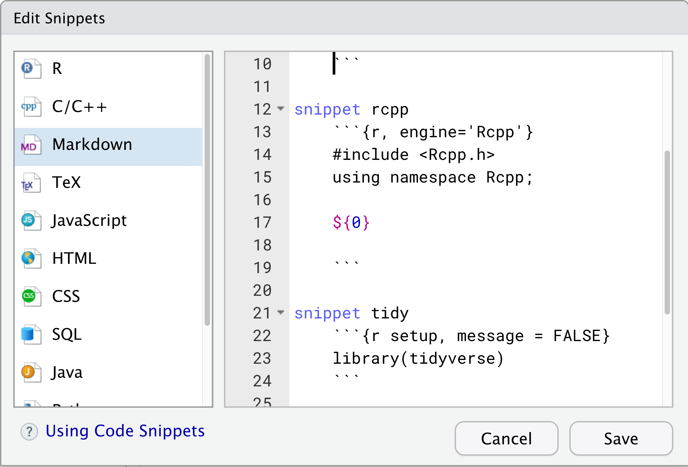
]

---

.pull-left[

## Add Your Own Snippet

#### Try it Out

1. Open new Rmarkdown file
2. Type `tidy`
3. Hit Shift + Tab

]

.middle[.pull-right[
<video width="400" height="400" controls>
    <source src="assets/snippet-tidy.mp4" type="video/mp4"> </video>
]]

---

## Learning Journey

I'd seen recommendations to use snippets in other learning resources:

* `shinyapp` in [Mastering Shiny](https://mastering-shiny.org/basic-app.html#create-app)
* `fun` in ?

I recognized one day a use case for myself

Led me to: https://support.rstudio.com/hc/en-us/articles/204463668-Code-Snippets

---
class: inverse center middle

# Raw Strings

---

.pull-left[

## Character Strings


```{r}
"Defined with double quotes"
```

]


---

.pull-left[

## Character Strings


```{r}
"Defined with double quotes"
```

```{r}
'Or single "quotes"'
```
]

---

.pull-left[

## Character Strings


```{r}
"Defined with double quotes"
```

```{r}
'Or single "quotes"'
```

Slashes signify an escape, so if you need a literal `\`, you need to escape it:
```{r}
writeLines("One: \\, Two: \\\\")
```
]

---

.pull-left[

## Character Strings


```{r}
"Defined with double quotes"
```

```{r}
'Or single "quotes"'
```

Slashes signify an escape, so if you need a literal `\`, you need to escape it:
```{r}
writeLines("One: \\, Two: \\\\")
```
]

.pull-right[
## Raw Strings

```{r}
r"(Defined with special syntax)"
```

]

---

.pull-left[

## Character Strings


```{r}
"Defined with double quotes"
```

```{r}
'Or single "quotes"'
```

Slashes signify an escape, so if you need a literal `\`, you need to escape it:
```{r}
writeLines("One: \\, Two: \\\\")
```
]

.pull-right[
## Raw Strings

```{r}
r"(Defined with special syntax)"
```

```{r}
r"(Or single "quotes")"
```

]

---

.pull-left[

## Character Strings


```{r}
"Defined with double quotes"
```

```{r}
'Or single "quotes"'
```

Slashes signify an escape, so if you need a literal `\`, you need to escape it:
```{r}
writeLines("One: \\, Two: \\\\")
```
]

.pull-right[
## Raw Strings

```{r}
r"(Defined with special syntax)"
```

```{r}
r"(Or single "quotes")"
```

Everything inside the delimiter, `"(`,  is taken literally
```{r}
writeLines(r"(One: \, Two: \\)")
```

]
---

layout:true

## Copy a Regular Expression

---

[How to validate an email address using a regular expression?](https://stackoverflow.com/questions/201323/how-to-validate-an-email-address-using-a-regular-expression) - Stack Overflow

Copy this long messy regular expression:
```txt
(?:[a-z0-9!#$%&'*+/=?^_`{|}~-]+(?:\.[a-z0-9!#$%&'*+/=?^_`{|}~-]+)*|"(?:[\x01-\x08\x0b\x0c\x0e-\x1f\x21\x23-\x5b\x5d-\x7f]|\\[\x01-\x09\x0b\x0c\x0e-\x7f])*")@(?:(?:[a-z0-9](?:[a-z0-9-]*[a-z0-9])?\.)+[a-z0-9](?:[a-z0-9-]*[a-z0-9])?|\[(?:(?:(2(5[0-5]|[0-4][0-9])|1[0-9][0-9]|[1-9]?[0-9]))\.){3}(?:(2(5[0-5]|[0-4][0-9])|1[0-9][0-9]|[1-9]?[0-9])|[a-z0-9-]*[a-z0-9]:(?:[\x01-\x08\x0b\x0c\x0e-\x1f\x21-\x5a\x53-\x7f]|\\[\x01-\x09\x0b\x0c\x0e-\x7f])+)\])
```

--

Straight into a raw string:
```{r}
email_pattern <- r"((?:[a-z0-9!#$%&'*+/=?^_`{|}~-]+(?:\.[a-z0-9!#$%&'*+/=?^_`{|}~-]+)*|"(?:[\x01-\x08\x0b\x0c\x0e-\x1f\x21\x23-\x5b\x5d-\x7f]|\\[\x01-\x09\x0b\x0c\x0e-\x7f])*")@(?:(?:[a-z0-9](?:[a-z0-9-]*[a-z0-9])?\.)+[a-z0-9](?:[a-z0-9-]*[a-z0-9])?|\[(?:(?:(2(5[0-5]|[0-4][0-9])|1[0-9][0-9]|[1-9]?[0-9]))\.){3}(?:(2(5[0-5]|[0-4][0-9])|1[0-9][0-9]|[1-9]?[0-9])|[a-z0-9-]*[a-z0-9]:(?:[\x01-\x08\x0b\x0c\x0e-\x1f\x21-\x5a\x53-\x7f]|\\[\x01-\x09\x0b\x0c\x0e-\x7f])+)\]))"
email_pattern
```

---


```{r}
stringr::str_detect(
  c("cwickham@gmail.com", "A-malformed.address"), email_pattern
)
```

--

### Other details

`r"{}"`, `r"[]"`, or `r"-()-"` (with any number of dashes)

`?Quotes`

---

layout: false

## Learning Journey

New in R 4.0.0 - So I could have read about it in NEWS, but I hadn't.

Tweet: someone mentioned native pipes coming in R

Led me to [keynotes at useR!2020](https://user2020.r-project.org/program/agenda/)

Ended up watching [New Developments in R 4.0.0 and Beyond (Part 1 and Part 2)](https://youtu.be/X_eDHNVceCU)

---
class: inverse center middle

# `gitcreds::gitcreds_set()`

---
.pull-left[

## Storing GitHub Credentials

I had `GITHUB_PAT` stored in `.Renviron`

Works great with [usethis](https://usethis.r-lib.org/) and [gh](https://gh.r-lib.org/)

Downside: sensitive information stored in a plain text file

]

.pull-right[
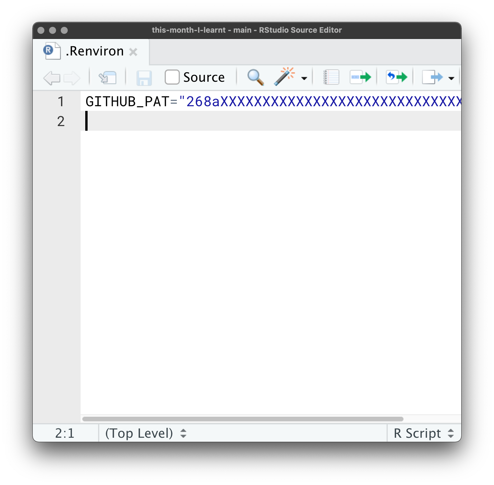
]

---

.pull-left[

##  Storing GitHub Credentials

#### A better way: `gitcreds::gitcreds_set()`

Uses your operating system credential manager:
* Mac: Keychain Access
* Windows: Credential Manager

Works seamlessly with usethis and gh

]

.pull-right[
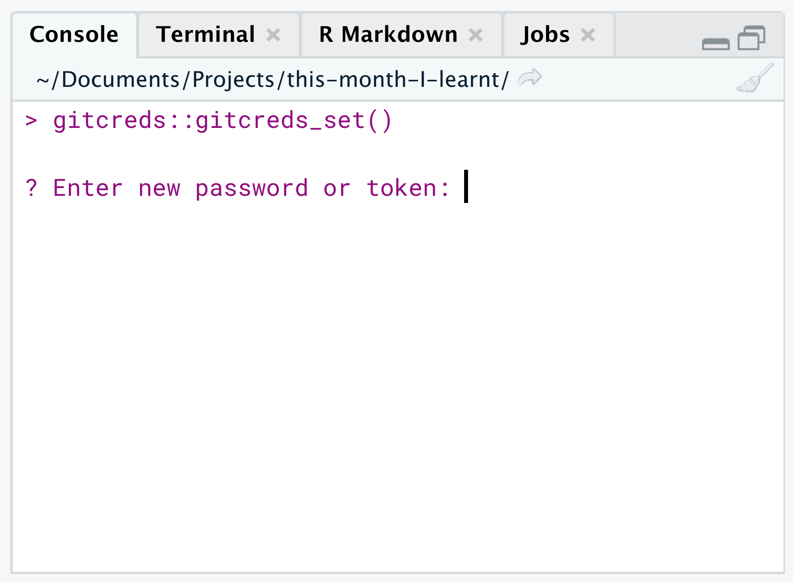
]

---

## Learning Journey

I use `usethis::git_sitrep()` a lot when working on projects

I had been ignoring this for awhile:
```
x Token may be mis-scoped: 'repo' and 'user' are highly recommended scopes
  The 'workflow' scope is needed to manage GitHub Actions workflow files
  If you are troubleshooting, consider this
```

One day I decided to fix it. Led me to:
https://usethis.r-lib.org/articles/articles/git-credentials.html


---
class: inverse center middle

# `dplyr::rowwise()`


---

### An simple table for illustration 

```{r}
library(tidyverse)
simple <- tibble(
  group = rep(c(1, 2), each = 3),
  x = 1:6
)
simple
```

---

### Functions in `mutate()` get the whole column

.pull-left[
```{r}
simple %>% 
  mutate(rank = rank(x))
```
]

.pull-right[
<center>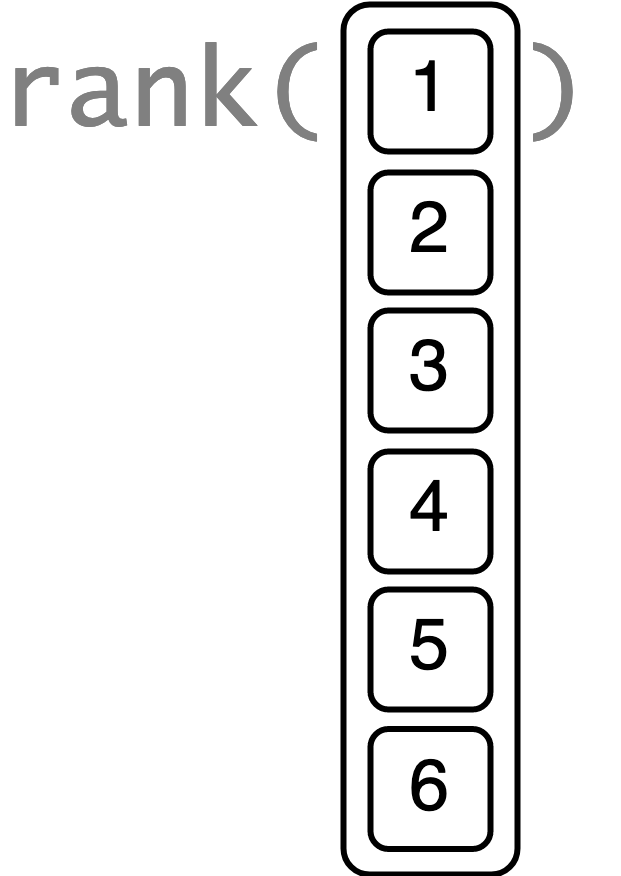</center>
]

---

### Adding `group_by`, splits that column up

.pull-left[
```{r}
simple %>% 
  group_by(group) %>% 
  mutate(rank = rank(x))
```
]

.pull-right[
<center>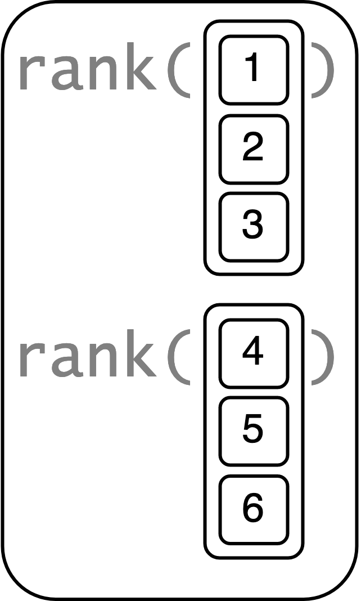</center>
]

---

### With `rowwise()`, one element at a time

.pull-left[
```{r}
simple %>% 
  rowwise() %>% 
  mutate(rank = rank(x))
```
]

.pull-right[
<center>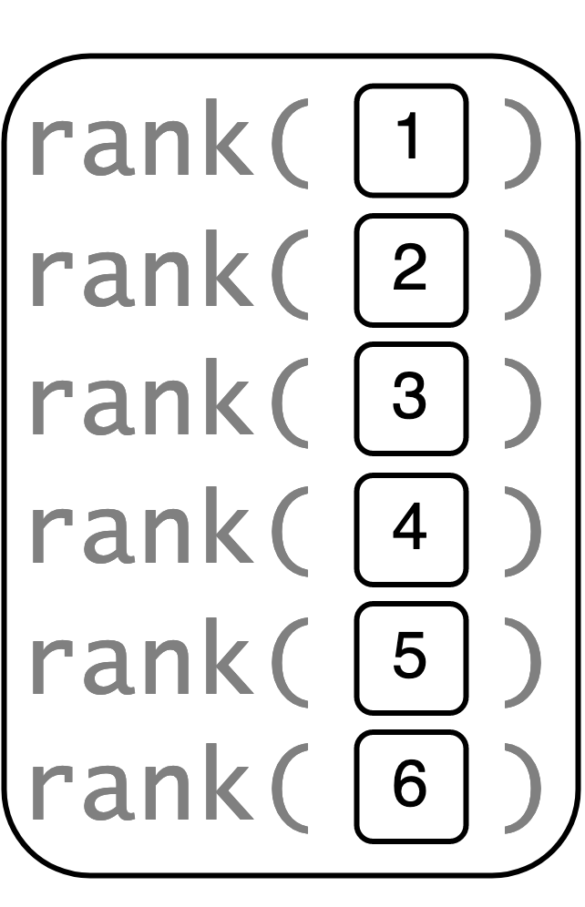</center>
]

---
layout:true

## Working with List Columns

---

.pull-left[
```{r starwars, eval = FALSE}
starwars %>% 
  select(name, films)
```
]

.pull-right[
```{r ref.label="starwars", echo=FALSE}
```
]

---


.pull-left[
```{r starwars_nfilms, eval = FALSE}
starwars %>% 
  select(name, films) %>% 
  rowwise() %>% 
  mutate(n_films = length(films))
```
]

.pull-right[
```{r ref.label="starwars_nfilms", echo=FALSE}
```
]

---
layout: true

## Creating List Columns

---

```{r starwars_nest}
starwars %>% 
  filter(species %in% c("Human", "Droid")) %>% 
  group_by(species) %>% 
  nest() 
```

---

```{r starwars_model, include = FALSE}
starwars %>% 
  filter(species %in% c("Human", "Droid")) %>% 
  group_by(species) %>% 
  nest() %>% 
  rowwise() %>% 
  mutate(
    model = list(lm(height ~ mass, data = data))
  )
```

```{r, echo = FALSE}
library(flair)
decorate("starwars_model") %>% 
  flair("list")
```


---


```{r}
starwars %>% 
  filter(species %in% c("Human", "Droid")) %>% 
  group_by(species) %>% 
  nest() %>% 
  rowwise() %>% 
  mutate(
    model = list(lm(height ~ mass, data = data)),
    slope = coefficients(model)[2]
  )
```

---

layout: false

## Learning Journey

I've known about `rowwise()` for awhile from [dplyr 1.0.0 previews](https://www.tidyverse.org/blog/2020/04/dplyr-1-0-0-rowwise/)

I hadn't really taken time to learn about it

I needed to teach iteration to novice R learners: Could I do it without using purrr?

Still figuring out best way to teach...

Read more at: https://dplyr.tidyverse.org/articles/rowwise.html

---

class: inverse center middle
# Getting Exposure

---

.pull-left[

## Read Release News

* [RStudio IDE blog](https://blog.rstudio.com/categories/rstudio-ide/)
* [Tidyverse blog](https://www.tidyverse.org/blog/)
* [R News](https://cran.r-project.org/doc/manuals/r-release/NEWS.html)

]

.pull-right[

]

---

.pull-left[

## Read Release News

* [RStudio IDE blog](https://blog.rstudio.com/categories/rstudio-ide/)
* [Tidyverse blog](https://www.tidyverse.org/blog/)
* [R News](https://cran.r-project.org/doc/manuals/r-release/NEWS.html)

## Conferences

* Attend
* Skim abstracts, track down GitHub repos
* If available, watch streams or recordings
]

.pull-right[

]

---

.pull-left[

## Read Release News

* [RStudio IDE blog](https://blog.rstudio.com/categories/rstudio-ide/)
* [Tidyverse blog](https://www.tidyverse.org/blog/)
* [R News](https://cran.r-project.org/doc/manuals/r-release/NEWS.html)

## Conferences

* Attend
* Skim abstracts, track down GitHub repos
* If available, watch streams or recordings
]

.pull-right[

## Stay connected

* [rstats twitter](https://twitter.com/search?q=%23rstats)
* meetups
* blogs
]

---

class: inverse center middle
# Final Thoughts

---

class: center middle

.pull-left[
## Find what works for you 
For me, sporadic, intensive "R time"  
usually built around conferences
]

.pull-right[
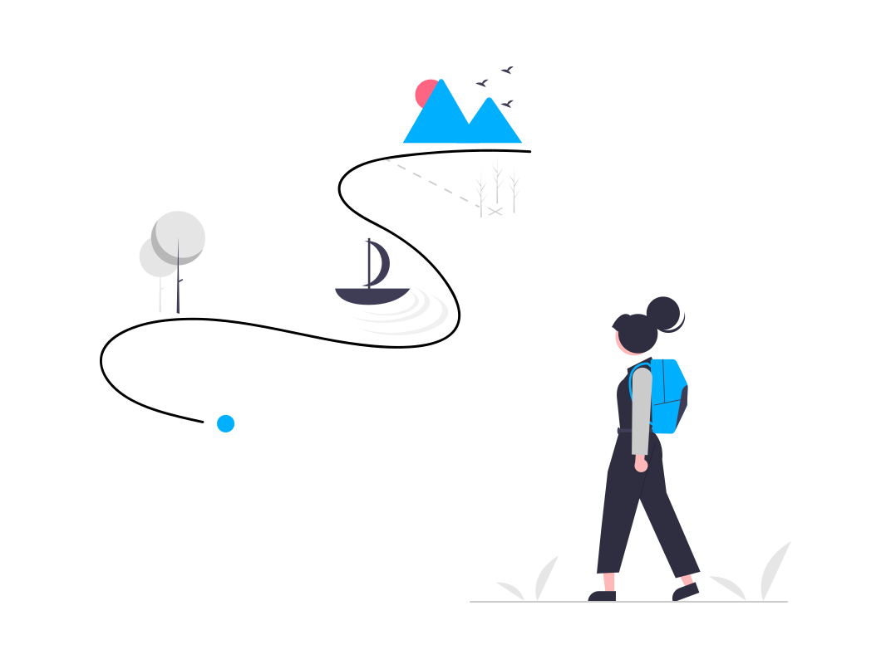
]

---

class: center middle

.pull-left[
## Give yourself permission and time to learn 
]

.pull-right[

]

---

class: center middle

.pull-left[
## Pick your battles
]

.pull-right[

]

---
class: center middle bg-navy white

## .white[Thank You]

<https://cwickham.github.io/this-month-I-learned/>  


.title[[`r icons::icon_style(icons::fontawesome("github"), fill = white)` @cwickham](https://github.com/cwickham)
[`r icons::icon_style(icons::fontawesome("twitter"), fill = white)` @cvwickham](https://twitter.com/cvwickham)]

.footnote[
Images: [undraw](https://undraw.co/)
]
